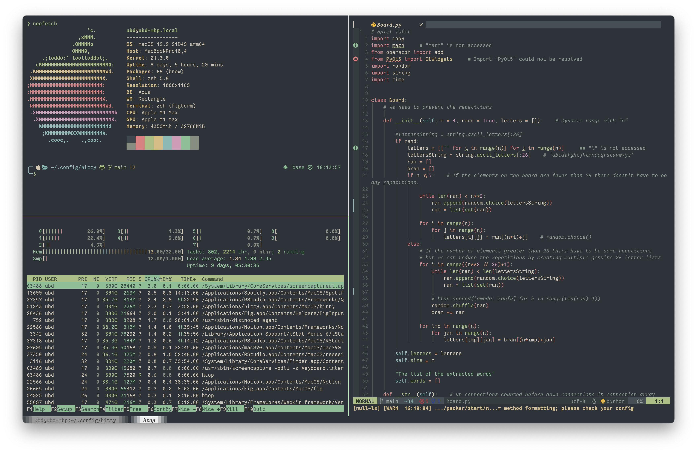

# utku - dotfiles
test

> **os/cpu-architecture**: macos 12.1/arm64
> 
> **terminal**: ~~alacritty iTerm2~~ kitty
> 
> **shell**: zsh ~~-> tmux~~ (friendship ended with tmux, now kitty integrated
> multiplexer is my best friend)

## Notes

* Neovim lua config is heavily copypasted from [ChristianChiarulli's repo](https://github.com/LunarVim/Neovim-from-scratch).

* Treesitter breaks the indentation. I've already disabled some of the
  filetypes in `./nvim/lua/ubd/treesitter.lua` but it might be better to disable
  it completely. Calling `set indentexpr` in neovim should show where the indentation
  comes from.

* ~~tmux doesn't play well with the color spectrum of alacritty which hits neovim pretty hard.
  What is happening:~~

  * ~~tmux doesn't recognize *alacritty* register ==> once tmux is activated
    alacritty will be registered either `xterm-256color`, `screen-256color` or
    simply as `screen`.~~
  
  * ~~Neovim will never stop complaining that `$TERM` output is different than the
    actual register.~~

  * ~~Hardcoding terminal name in `alacritty.yml` and `tmux.conf` does not help
    but defining it in `.zshrc` somehow helps *temporarily*.~~

   * [x] TODO: Right now, it is broken again without changing anything; investigate the situation.

    * ~~~Solution was simple: switch to iTerm2~~~
    * ~~Alacritty now works well with tmux~~
    * ~~Kitty is also set up  with this configuration but doesn't seem appealing
      to me yet~~
    * Alacritty+tmux struggling to point to the Conda-Env. compiler ==> moving
      to Kitty.

* [x] TODO: translate ultisnips to lua

  * [Here is an amazing script that handles the translation flawlessly](https://github.com/L3MON4D3/LuaSnip/issues/201#issuecomment-950132369)

  * [ ] TODO: I've added the translated lines into the latex snippets of
    `friendly-snippets` but I'm pretty sure there is a better location/method
    for this. Find it.

* `tmux_line` configs are from [sainhe's dotfiles](https://github.com/sainnhe/dotfiles)

* [Fig sytem-wide auto-completion](https://github.com/withfig/fig) added but
  symlinking their config files causes problems (?).

  * [x] TODO: Fix fig integration in tmux.

    * Alacritty, Kitty, tmux integrations aren't working seamless yet but
    [this solution](https://github.com/withfig/fig/issues/26#issuecomment-1022537900) seems to work.

